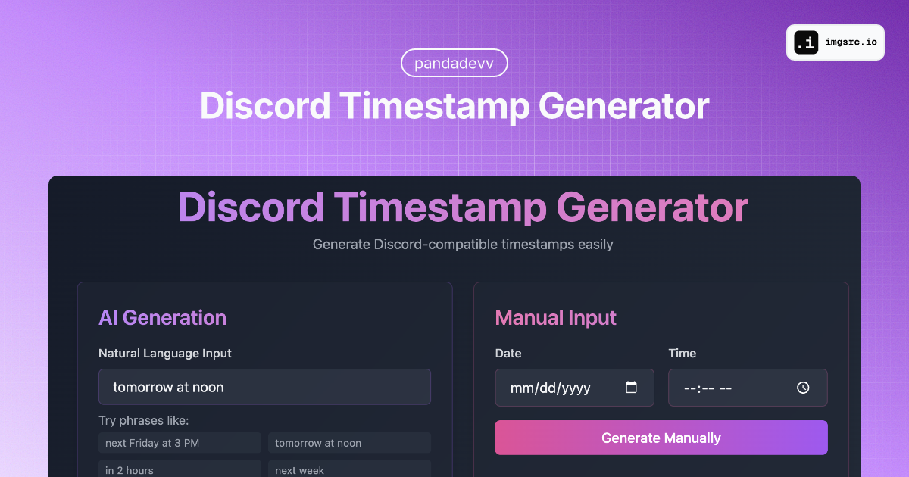

# Discord Timestamp Generator

<div align="center">



[](https://opensource.org/licenses/MIT)
[](https://vuejs.org/)
[](https://timestamp.pandadevv.dev)

A modern, user-friendly tool for generating Discord-compatible timestamps with natural language support. Built with Vue.js and featuring a sleek dark mode interface.

[View Demo](https://timestamp.pandadevv.dev) • [Report Bug](https://github.com/jackh54/Discord-Timestamp-Gen/issues) • [Request Feature](https://github.com/jackh54/Discord-Timestamp-Gen/issues)

</div>

## ✨ Features

- 🤖 **Natural Language Processing** - Enter dates in plain English
- ⚡ **Real-time Preview** - See how your timestamps will look in Discord
- 🎨 **Modern Dark Theme** - Easy on the eyes with a beautiful UI
- 📱 **Responsive Design** - Works perfectly on all devices
- 🔄 **Multiple Format Support** - All Discord timestamp formats supported
- 📋 **One-Click Copy** - Easily copy timestamps to clipboard
- ⌚ **Current Time** - Quick button to use current time
- 🎯 **Manual Input** - Traditional date/time picker available

## 🚀 Quick Start

### Prerequisites

- Node.js 16.x or higher
- npm or yarn

### Installation

1. Clone the repository
```bash
git clone https://github.com/jackh54/Discord-Timestamp-Gen.git
cd Discord-Timestamp-Gen
```

2. Install dependencies
```bash
npm install
# or
yarn install
```

3. Start the development server
```bash
npm run dev
# or
yarn dev
```

4. Open [http://localhost:3000](http://localhost:3000) in your browser

## 📖 Usage Guide

### Natural Language Input
Simply type phrases like:
- "next Friday at 3 PM"
- "tomorrow at noon"
- "in 2 hours"
- "next week"
- "this weekend"

### Manual Input
If you prefer precise control:
1. Select your date using the date picker
2. Choose your time using the time picker
3. Click "Generate Manually"

### Supported Timestamp Formats

| Format | Style | Example | Output |
|--------|--------|---------|---------|
| Short Time | t | `<t:1234567890:t>` | 16:20 |
| Long Time | T | `<t:1234567890:T>` | 16:20:30 |
| Short Date | d | `<t:1234567890:d>` | 20/04/2023 |
| Long Date | D | `<t:1234567890:D>` | 20 April 2023 |
| Short Date/Time | f | `<t:1234567890:f>` | 20 April 2023 16:20 |
| Long Date/Time | F | `<t:1234567890:F>` | Thursday, 20 April 2023 16:20 |
| Relative Time | R | `<t:1234567890:R>` | 2 hours ago |

## 🛠️ Built With

- [Vue.js 3](https://vuejs.org/) - The Progressive JavaScript Framework
- [Vite](https://vitejs.dev/) - Next Generation Frontend Tooling
- [Tailwind CSS](https://tailwindcss.com/) - A utility-first CSS framework
- [Compromise NLP](https://github.com/spencermountain/compromise) - Natural language processing
- [date-fns](https://date-fns.org/) - Modern JavaScript date utility library
- [Vue Toast Notification](https://github.com/ankurk91/vue-toast-notification) - Toast notification plugin

## 🤝 Contributing

Contributions are what make the open source community such an amazing place to learn, inspire, and create. Any contributions you make are **greatly appreciated**.

1. Fork the Project
2. Create your Feature Branch (`git checkout -b feature/AmazingFeature`)
3. Commit your Changes (`git commit -m 'Add some AmazingFeature'`)
4. Push to the Branch (`git push origin feature/AmazingFeature`)
5. Open a Pull Request

## 📝 License

Distributed under the MIT License. See `LICENSE` for more information.

## 👤 Author

**pandadevv**

- Website: [pandadevv.dev](https://pandadevv.dev)
- Github: [@jackh54](https://github.com/jackh54)

## ⭐ Show your support

Don't forget to ⭐ *and follow*!